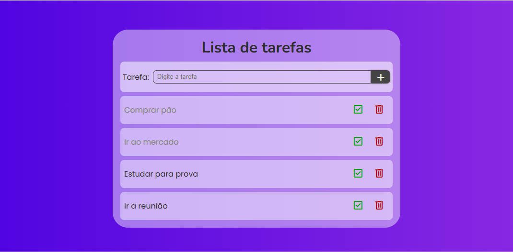

# 📋 Lista de Tarefas

Projeto de uma aplicação web simples e funcional para gerenciamento de tarefas, construída com HTML, CSS e JavaScript puro.

---

## 🧠 Objetivo

Este projeto tem como finalidade praticar os fundamentos de **manipulação do DOM**, **eventos**, **responsividade** e boas práticas de **estruturação de projetos front-end**.

---

## ✨ Funcionalidades

- ✅ Adicionar novas tarefas
- ✅ Marcar tarefas como concluídas
- ✅ Desabilitar botão de exclusão até a conclusão da tarefa
- ✅ Remover tarefas concluídas
- ✅ Interface responsiva com design moderno
- ✅ Foco automático no campo de input após adicionar
- ✅ Feedback visual ao concluir tarefas

---

## 📷 Demonstração

  
<sub>*Exemplo visual da aplicação em funcionamento*</sub>

---

## 🛠 Tecnologias utilizadas

- **HTML5** — estrutura da aplicação
- **CSS3** — estilização responsiva e customizada
- **JavaScript Vanilla** — lógica de manipulação do DOM
- **Google Material Symbols** — ícones de ação
- **Google Fonts (Poppins e Nunito)** — tipografia

---

## 📁 Estrutura de pastas
```
/lista-de-tarefas
├── index.html
├── README.md
├── src
│   ├── css
│   │   └── style.css
│   ├── images
│   │   ├── favicon.png
│   │   └── preview.png
│   └── script
│       └── script.js
```
---

## ⚙️ Como usar

1. Clone o repositório:

```bash
git clone https://github.com/seu-usuario/nome-do-repositorio.git
```

2. Acesse em: [https://charlesson-mp.github.io/lista-de-tarefas/](https://charlesson-mp.github.io/lista-de-tarefas/)


---

## 🔒 Licença

Este projeto está licenciado sob a MIT License.

---

## 💬 Contato

Desenvolvido por Charlesson Mendes<br>
📫 charlessonmendes@gmail.com<br>
🌐 charlesson-mp.github.io/portfolio-page